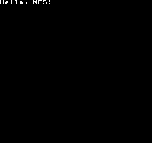

# Hello, NES!

This is an extremely basic ROM which just shows the text &ldquo;Hello, NES&rdquo; in the top&hyphen;left corner of the screen.  
  
This is also the first ever homebrew thing I've ever made for the NES! It uses a single 16KiB bank of program ROM, making it possibly the smallest valid iNES file.

## Build Instructions

1. Download [cc65](https://cc65.github.io/) and add the installation directory to the PATH
2. Run [make.bat](./make.bat) (sorry linux users, idk)
